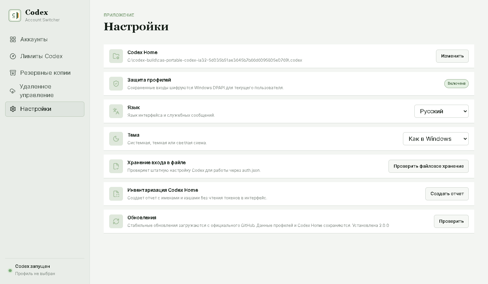

# Codex Account Switcher for Windows

[](https://github.com/korsun009/codex-account-switcher/releases/latest)
[](https://github.com/korsun009/codex-account-switcher/releases)
[](https://github.com/korsun009/codex-account-switcher/releases/latest)
[](LICENSE)

[Русский](docs/ru/README.md) | **English** | [中文](docs/zh/README.md)

Codex Account Switcher is an open-source Windows desktop app for safely switching between multiple OpenAI Codex accounts, viewing 5-hour and weekly usage limits, and controlling Codex from an optional Telegram bot. It keeps one shared Codex Home for chats, projects, MCP servers, plugins, skills, and settings while changing only the active sign-in.



## Download v2.0.0

Download assets from [GitHub Releases](https://github.com/korsun009/codex-account-switcher/releases/latest) and verify them with `SHA256SUMS.txt`.

| Windows | Recommended auto-update installer | Architecture installer | MSI | Portable |
| --- | --- | --- | --- | --- |
| 10/11 x64 | `Codex-Account-Switcher-2.0.0-Setup.exe` | `Codex-Account-Switcher-2.0.0-x64-Setup.exe` | `Codex-Account-Switcher-2.0.0-x64-Setup.msi` | `Codex-Account-Switcher-2.0.0-x64-Portable.zip` |
| 10/11 x86 | `Codex-Account-Switcher-2.0.0-Setup.exe` | `Codex-Account-Switcher-2.0.0-ia32-Setup.exe` | `Codex-Account-Switcher-2.0.0-ia32-Setup.msi` | `Codex-Account-Switcher-2.0.0-ia32-Portable.zip` |

`ia32` is the Electron name for 32-bit x86 Windows. The self-contained builds do not require a separate .NET installation. macOS, Linux, Windows 8, and Windows 8.1 are not supported.

> **Unsigned release:** v2.0.0 does not yet have an Authenticode Code Signing certificate. Windows may show an unknown-publisher or SmartScreen warning. SHA-256 checksums prove download integrity but do not replace a trusted publisher signature. This limitation is stated in the release notes and will be removed only after a trusted certificate is configured.

## Features

- Add, rename, remove, and switch Codex account profiles from a Russian, English, or Chinese interface.
- Keep chats, projects, sessions, MCP servers, plugins, skills, and tool configuration shared in one `.codex` directory.
- Encrypt saved profile credentials with Windows DPAPI for the current Windows user.
- Validate `auth.json`, create an encrypted backup, and support rollback before replacing the live sign-in.
- Show 5-hour and weekly Codex limits for all saved profiles without displaying bearer tokens.
- Find and start Codex desktop processes from installed and packaged Windows locations.
- Store app settings and profile metadata in a local SQLite database.
- Check, download, and install stable updates through three separate user actions.
- Provide an optional authenticated Remote API and a button-first Telegram control plane.
- Support automatic, dark, gray, and light themes.

## Quick Start

1. Install the recommended NSIS `.exe`, install the MSI, or unpack the portable ZIP.
2. Open **Codex Account Switcher** and confirm the detected Codex Home folder.
3. Select **Add account**, enter a display name, and open Codex from the guided flow.
4. Sign in to the required account in Codex, return to the switcher, and save the sign-in.
5. Use **Switch** on a profile card. Do not use the normal Codex logout button between saved profiles because logout can revoke the refresh token.

The NSIS installer is recommended because the in-app updater downloads that format. MSI and portable users can check for a release in the app, then update manually from GitHub Releases.

## Security Model

- Only the live `auth.json` is switched. Shared Codex data is not copied per account.
- Saved profile credentials and credential backups are encrypted as `auth.dpapi` with Windows DPAPI `CurrentUser`.
- A legacy plaintext profile is migrated only after encrypted write, decrypt, validation, and byte comparison succeed; the legacy file is then deleted.
- DPAPI files are bound to the Windows user profile. Do not sync or copy them to another PC as a credential-transfer mechanism. Profile names may appear on another synchronized PC, but encrypted sign-ins are not portable.
- Tokens are never stored in SQLite, returned by the Remote API, or printed in the interface.
- The app does not bypass subscriptions, rate limits, account controls, or OpenAI access rules.

See [SECURITY.md](SECURITY.md) for reporting and deployment boundaries.

## Telegram Remote Control

The app includes a sanitized direct-bot template in [`integrations/telegram-bot`](integrations/telegram-bot). A separate deployment repository, [codex-telegram-remote](https://github.com/korsun009/codex-telegram-remote), contains the recommended VPS bot, LAN gateway, reverse SSH tunnel, and systemd units.

Available buttons cover PC status and Wake-on-LAN, accounts and limits, Codex start/stop, V2RayTun status/start/Proxy Mode/restart, sleep, reboot, and shutdown. Power actions require a short-lived one-time confirmation. The bot reads account names and limits from the current desktop API, so account additions and removals stay synchronized.

Use [the GUI and Telegram setup guide](docs/TELEGRAM_GUI_SETUP.md) and [Remote API reference](docs/REMOTE_API.md). Never expose the Windows Remote API directly to the public internet.

## Updates

The app checks the stable GitHub `latest` channel only after the user presses **Check for updates**. A found update is downloaded only after a second action and installed only after a third action. Publishing `latest.yml`, both NSIS blockmaps, and the matching installers is part of every release gate.

## Community Translations

Community translations are welcome. Fork the repository, edit the language entries in [`desktop/src/renderer/src/locales/translations.json`](desktop/src/renderer/src/locales/translations.json), keep the key structure and `{{placeholders}}` aligned with Russian, run the validation commands, and open a pull request. The complete workflow is in [docs/TRANSLATIONS.md](docs/TRANSLATIONS.md).

## Build and Test

Requirements: Windows 10/11, PowerShell 7.4+, Node.js 22+, pnpm 11+, and .NET 8 SDK.

```powershell
dotnet test .\codex-account-switcher\CodexAccountSwitcher.sln --configuration Release
Push-Location .\desktop
pnpm install --frozen-lockfile
pnpm typecheck
pnpm test
Pop-Location
pwsh -File .\scripts\build-release.ps1
```

The production build rejects unsigned executables by default. `-AllowUnsigned` is reserved for explicit local candidates and does not make them signed.

See [CONTRIBUTING.md](CONTRIBUTING.md), [v2.0.0 release notes](docs/RELEASE_NOTES_2.0.0.md), and the [MIT license](LICENSE).
